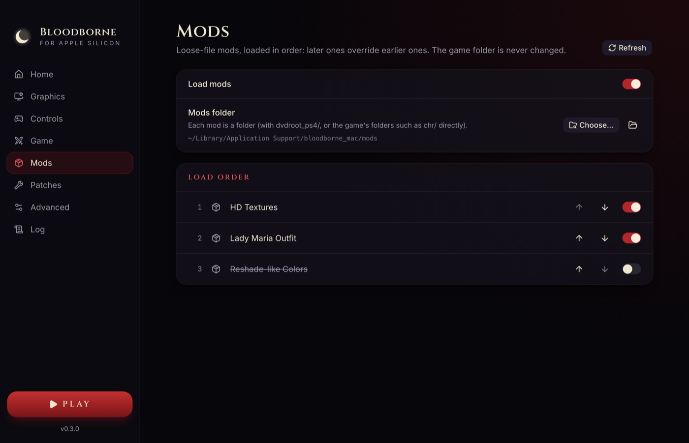

# Mods and patches

[← Documentation](../README.md)

## Mods



Mods are loose game files that replace the game's own: textures, models, parameters, menus,
sounds and fonts. The game folder is never changed. At start, the port builds a merged view of
the game with the enabled mods on top.

### Installing a mod

1. Open the launcher's **Mods** tab and press the folder button to open the mods folder
   (`~/Library/Application Support/bloodborne_mac/mods` by default).
2. Unzip the mod into its own folder there:

   ```text
   mods/
     Mod name/
       dvdroot_ps4/
         chr/...
         parts/...
   ```

   These layouts work too:

   - `Mod name/app0/dvdroot_ps4/...` or `Mod name/CUSA03173/dvdroot_ps4/...`
   - an extra wrapper folder, as left by unzipping: `Mod name/Mod name v1.2/dvdroot_ps4/...`
   - the game's folders directly: `Mod name/chr/...`, `Mod name/parts/...`
3. Press **Refresh**. New mods are enabled and added at the end of the list.

### Load order

Mods lower in the list win when two mods replace the same file. Use the arrows to reorder, and the
switch to turn a mod off. **Load mods** turns all of them off at once. Changes apply at the next
start.

Letter case does not matter: a mod made on Windows with `DVDROOT_PS4/Chr/...` replaces the
game's `dvdroot_ps4/chr/...`.

### Limits

- Archives (ZIP, 7z) must be unzipped first.
- Two mods that change the same `.dcx` or `.bnd` file are not merged: the later one replaces the
  whole file.
- Mods that replace `eboot.bin`, `sce_module` or `sce_sys`, DLL injectors and script plug-ins are
  not supported.
- A mod must be made for the 1.09 version of the game.

The log tells how many game files each mod replaced (`Mods: 12 game files replaced, 0 added`). If
a mod should replace files but reports `0 game files replaced`, check the folders inside it.

## Patches

Patches change the game's code, for example to unlock the frame rate or skip the intro videos.

- **Built-in patches** (community patches in `patches/Bloodborne.xml`) are set from the
  launcher's **Game** tab and the in-game menu.
- **Third-party patches:** put XML patch files in the shadPS4/GoldHEN format into the patches
  folder (**Patches** tab → folder button), then turn each patch on or off in the list.

Only patches for version `01.09` and `eboot.bin` are listed. Third-party patches are applied after
the built-in ones, so they win where they overlap. Patches that use pattern search (`mask`
lines) are skipped, with a note in the log.
