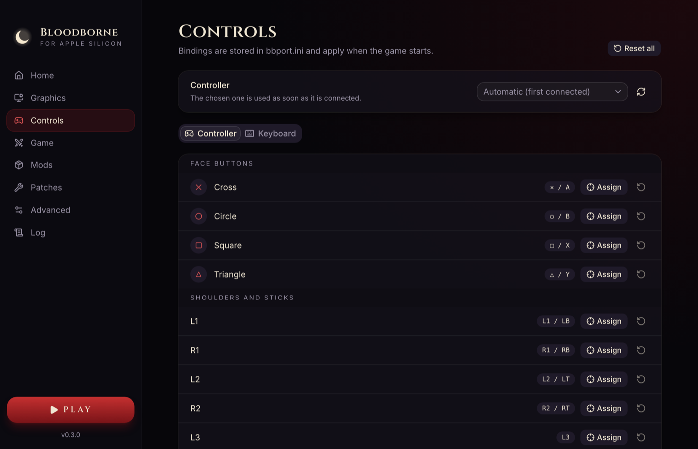
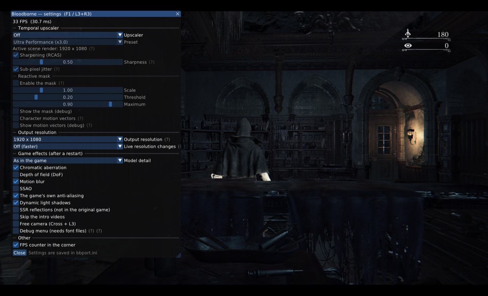

# Settings

[← Documentation](../README.md)

Settings can be changed in two places: the launcher, before starting the game, and the in-game
menu, while playing. Both use the same file (`bbport.ini`), so a change in one shows up in the
other.

## The launcher

| Tab | What it has |
|---|---|
| **Home** | The game folder, its edition and whether it is ready to play, and a summary of the main settings |
| **Graphics** | Output resolution, fullscreen, frame presentation (V-Sync), FPS counter, upscaler and its quality preset, sharpening, character motion vectors, model detail |
| **Controls** | Which controller to use, and button mapping for controller and keyboard |
| **Game** | The game's language, game effects (motion blur, depth of field, shadows, ...), frame rate, extras (skip the intro, debug camera and menu) and the saves folder |
| **Mods** | Mods and their load order. See [Mods and patches](mods-and-patches.md) |
| **Patches** | Third-party game patches. See [Mods and patches](mods-and-patches.md) |
| **Advanced** | Launcher language, performance options, diagnostics, extra environment variables and the data folder |
| **Log** | The game's output while it runs |

## The in-game menu

Press **F1** on the keyboard, or **L3 + R3** on a controller, to open the settings menu over the
game. Most graphics settings apply right away. Settings that need a restart say so, and the menu
has a button to restart the game.

## Languages

The launcher and the in-game menu are available in the 20 languages of the PS4 game:

English, Português (Brasil), Português (Portugal), Español (España), Español (Latinoamérica),
Français, Deutsch, Italiano, Nederlands, Polski, Русский, Türkçe, Suomi, Svenska, Dansk, Norsk,
日本語, 한국어, 简体中文 and 繁體中文.

- **Launcher language:** Advanced → Launcher language. By default it follows macOS.
- **In-game menu:** follows the launcher's language.
- **Game language** (the game's own text and voices): Game → Language. Every language the PS4
  version offers can be chosen, Portuguese included.

## Recommended settings

On Apple Silicon the game is limited by the GPU, so upscaling gives the largest gain:

- **Upscaler:** FSR 3.1 with the *Balanced* or *Performance* preset.
- **Character motion vectors:** off (the default on macOS). They improve FSR on moving characters
  but cost about 5 ms per frame on Apple GPUs.

With a 1080p output, the upscaler preset sets the resolution the whole game renders at from the
start, so changing the preset needs a restart.

See [Performance](performance.md) for measurements.

## Controllers

Controllers work through SDL3: PlayStation, Xbox and other common controllers are recognized.
Without a controller, the keyboard can be used; its keys can be remapped on the **Controls** tab.
